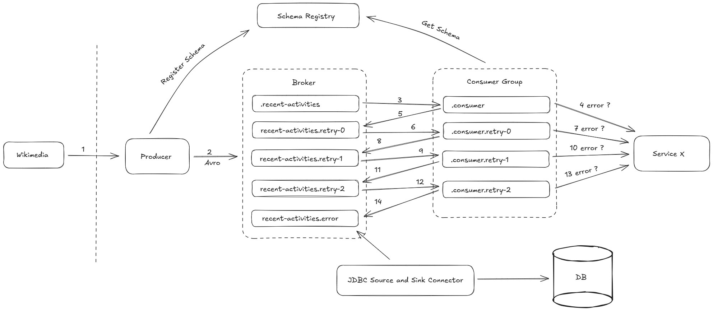

# Kafka Development Project

## 🚀 Tech Stack
- **Java 23**
- **Spring Boot**
- **Kafka**
- **PostgreSQL**

## 🏗️ Architecture 


## 📌 Project Overview
This project is a Kafka development initiative where I have implemented most of Kafka's functionalities. It uses Wikimedia's open-source streams as a source to collect and process real-time data.

The overall process involves a producer that receives all streams from Wikimedia and publishes them to the wikimedia.recent-activities topic in Avro format. A schema registry is utilized, and the producer publishes the Avro schema. Subsequently, the consumer deserializes the Avro data into JSON and sends it to Service X, which is represented in this project as a monitoring service. The monitoring service currently only exposes an API to consume the data, leaving room for future enhancements, such as adding full monitoring functionality.

If the consumer fails to process the message and forward it to Service X, a retry mechanism is triggered. Should the retries also fail, the messages are forwarded to the dead letter topic (wikimedia.recent-activities.error). Kafka Connect is then employed to read these messages from the dead letter topic and insert them into a PostgreSQL database, utilizing the JDBC Source and Sink Connector.

The architecture is designed with numbered arrows to represent the flow of data transactions. Notably, NullPointerExceptions are intentionally not handled in this project to observe the behavior of the retry mechanism.

---

## 🛠️ Steps to Set Up the Project

### 🚀 Running the Project
Run the following command to start the Kafka ecosystem using Docker Compose
   ```bash
   docker compose up -d
   ```
After that, you can run the services in your favorite IDE

### 🔧 Project details

- Producer port - 8090
- Consumer port - 8091
- Monitoring port - 8092
    


Conduktor is used for the Kafka UI
You can find the credentials for login in the platform-config.yml file

#### Kafka Connect requires manual configuration. Use the following command to register the connector:
```
curl -X POST -H "Content-Type: application/json" \
  --data '{
    "name": "jdbc-sink-connector",
    "config": {
        "connector.class": "io.confluent.connect.jdbc.JdbcSinkConnector",
        "tasks.max": "3",
        "topics": "wikimedia.recent-activities.error",
        "connection.url": "jdbc:postgresql://{{YOUR_IP}}:5433/wikimedia_retry",
        "connection.user": "user",
        "connection.password": "password",
        "table.name.format": "wikimedia_record",
        "insert.mode": "insert",
        "key.converter": "org.apache.kafka.connect.storage.StringConverter",
        "value.converter": "io.confluent.connect.avro.AvroConverter",
        "value.converter.schemas.enable": "true",
        "value.converter.enhanced.avro.schema.support": "true",
        "auto.create": "true",
        "auto.evolve": "true",
        "pk.mode": "none",
        "batch.size": "1000",
        "key.converter.schema.registry.url": "http://{{YOUR_IP}}:8081",
        "value.converter.schema.registry.url": "http://{{YOUR_IP}}:8081",
        "errors.tolerance": "all",
        "errors.log.enable": "true",
        "errors.log.include.messages": "true",
        "transforms": "flatten",
        "transforms.flatten.type": "org.apache.kafka.connect.transforms.Flatten$Value",
        "transforms.flatten.delimiter": "_"
    }
  }' \
  http://localhost:8083/connectors
```
### Important Notes

- **Replace** `{{YOUR_IP}}` with the IP address of your machine.
- For easier development, **Landoop's Kafka Connect UI** is utilized. Alternatively, **Conduktor's UI** also supports Kafka Connect, though it requires manual registration.
  
  To use **Conduktor's Kafka Connect Interface**:
  1. Navigate to **Kafka Connect** → **Manage Cluster**.
  2. Select your cluster and click on **Kafka Connect**.
  3. Use the **Add Connector** button with the following URL:  
     `http://{{YOUR_IP}}:8083`

### 🔄 Producer Management APIs

Use the following APIs to start or stop the producer:
```
GET - http://localhost:8090/producer/start
GET - http://localhost:8090/producer/stop
```

---
## 📈 Future Enhancements
- Add real-time monitoring capabilities to **Service X**.
- Develop analytics tools for dead-letter messages.
- Improve error handling for edge cases.

